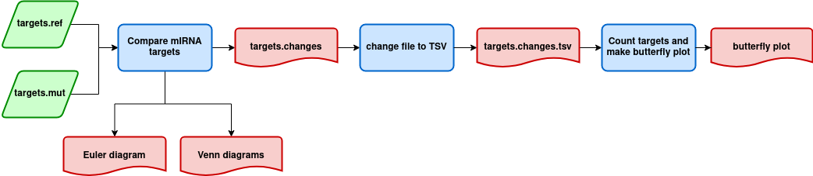

# **nf-plot-microRNA-targets**

Nextflow pipeline that compare microRNA targets of two datasets
(reference and mutate) and plot the microRNA target changes.

------------------------------------------------------------------------

### Workflow overview

------------------------------------------------------------------------

## Requirements

#### Compatible OS\*:

-   [Ubuntu 18.04.03 LTS](http://releases.ubuntu.com/18.04/)

#### Software:

|                    Requirement                     |          Version           |  Required Commands \*  |
|:--------------------------------------------------:|:--------------------------:|:----------------------:|
|  [Plan9 port](https://github.com/9fans/plan9port)  | Latest (as of 10/01/2019 ) |        mk \*\*         |
|        [Nextflow](https://www.nextflow.io/)        |          21.04.2           |        nextflow        |
|          [R](https://www.r-project.org/)           |           3.4.4            |   \*\* See R scripts   |
| [Python](https://www.python.org/downloads/source/) |           3.6.9            | \*\*See python scripts |

\* These commands must be accessible from your `$PATH` (*i.e.* you
should be able to invoke them from your command line).

\*\* Plan9 port builds many binaries, but you ONLY need the `mk` utility
to be accessible from your command line.

### Installation

Download plot-microRNA-targets.nf from Github repository:

    git clone https://github.com/Ed-G655/nf-compare-miRNA-pairs.git

------------------------------------------------------------------------

#### Test

To test plot-miRNA-pairs.nf execution using test data, run:

    ./runtest.sh

Your console should print the Nextflow log for the run, once every
process has been submitted, the following message will appear:

     ======
     Basic pipeline TEST SUCCESSFUL
     ======

compare-miRNA-pairs.nf results for test data should be in the following
file:

    nf-plot-miRNA-pairs/test/results/

------------------------------------------------------------------------

### Usage

To run compare-miRNA-pairs go to the pipeline directory and execute:

    nextflow run plot-miRNA-pairs.nf--mirnafasta <path to input 1> --utrfasta <path to input 2> [--output_dir path to results ]

For information about options and parameters, run:

    nextflow run plot-miRNA-pairs.nf --help

------------------------------------------------------------------------

#### References

-   Charles E. Vejnar and Evgeny M. Zdobnov miRmap: Comprehensive
    prediction of microRNA target repression strength Nucleic Acids
    Research 2012 Dec 1;40(22):11673-83. doi: 10.1093/nar/gks901
-   Lewis, B. P., Burge, C. B., & Bartel, D. P. (2005). Conserved seed
    pairing, often flanked by adenosines, indicates that thousands of
    human genes are microRNA targets. Cell, 120(1), 15--20.
    <https://doi.org/10.1016/j.cell.2004.12.035> ---

#### Autors

José Eduardo García López
